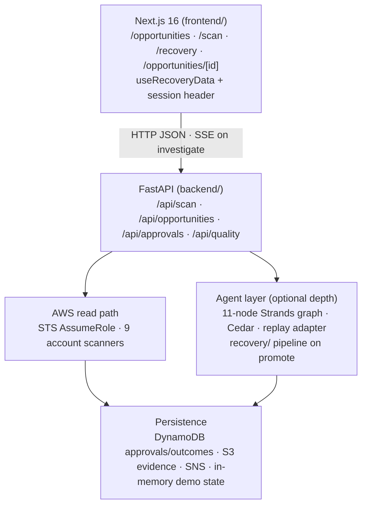
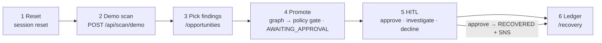
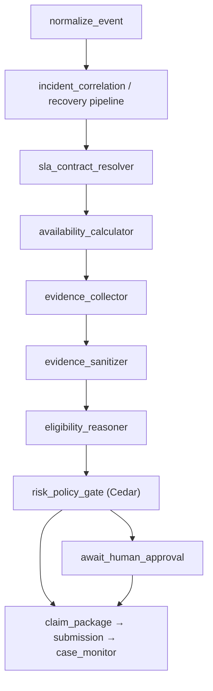

# Recoup — System Architecture (canonical diagram)

**Primary product path:** **J-FULL** — demo scan → promote → HITL → Recovery Ledger (+ SNS on approve).  
**Production:** App Runner UI + API (see [docs/archive/ops/production-hosting.md](../docs/archive/ops/production-hosting.md)).  
**Last updated:** Sep 14, 2026

Narrative detail: [docs/recoup-overall-architecture.md](../docs/recoup-overall-architecture.md) · [docs/operator-journey.md](../docs/operator-journey.md).

---

## High-level stack

---

## J-FULL operator lifecycle

---

## Agent graph (optional — not streamed on promote)

Promote runs the graph **through `risk_policy_gate`** with the **recovery/** pipeline for scan findings. Full SSE replay: `GET /api/opportunities/{id}/stream` after investigate.
