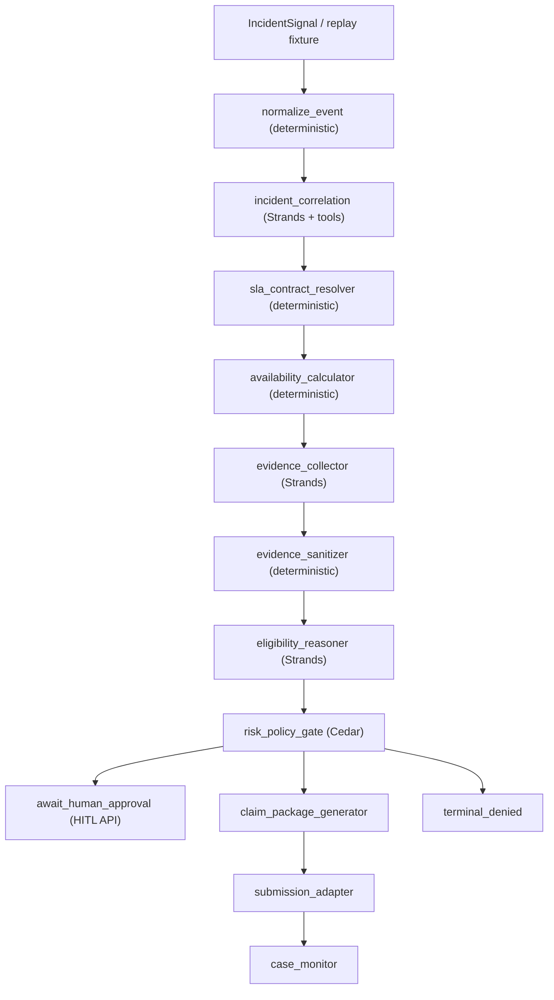

# Recoup Agent Layer — Code & Architecture (J-FULL context)

**Scope:** Agent graph, Strands/Bedrock, replay, tools, and AgentCore adapters under `backend/src/recoup/`.  
**Operator journey reference:** [operator-journey.md](operator-journey.md) — **J-FULL does not stream the graph on promote**; this document explains what the agent layer is and when it runs.  
**Last updated:** Sep 13, 2026

---

## Three layers (do not conflate)

| Layer | Code anchor | J-FULL? |
|-------|-------------|---------|
| **Operator loop** | Scanners + promote + HITL (`scan.py`, `approvals.py`) | **Yes — primary** |
| **11-step UI language** | Frontend `PIPELINE_STEPS` / `pipelineStageForOpportunity` | **Yes — narrative strip** |
| **11-node agent graph** | `graph/recoup_graph.py` | **Optional** — `POST /api/opportunities/{id}/run`, SSE `/stream`, pytest replay |

On **promote**, the backend **runs the graph through `risk_policy_gate`** (not SSE-streamed). For **optimization / scan** findings, node **`incident_correlation`** calls **`recovery/pipeline.py`** (`run_recovery_pipeline`) to produce a full **`RecoveryAssessment`**; downstream nodes **short-circuit** when `_recovery_complete(state)`. SLA replay fixtures still use the classic stub path in the same node. UI narrative still collapses steps 2–7 on the strip.

---

## Graph topology

**Builder:** `graph/recoup_graph.py` — `build_recoup_graph()` / module singleton `recoup_graph`.

**Nodes (11 execution units + 2 virtual terminals):**

| # | Node | Type | Module / agent |
|---|------|------|----------------|
| 1 | `normalize_event` | Deterministic | `graph/nodes.py` |
| 2 | `incident_correlation` | Agent (Strands) | `agents/strands_agents.run_incident_correlation_agent` |
| 3 | `sla_contract_resolver` | Deterministic | `engines/sla_resolver` via nodes |
| 4 | `availability_calculator` | Deterministic | `engines/calculator.py` |
| 5 | `evidence_collector` | Agent | Strands + tools |
| 6 | `evidence_sanitizer` | Deterministic | `evidence/sanitizer.py` |
| 7 | `eligibility_reasoner` | Agent | Strands |
| 8 | `risk_policy_gate` | Deterministic | Cedar via `safety/cedar.py` |
| — | `await_human_approval` | Virtual terminal | Graph pauses; HITL external |
| 9 | `claim_package_generator` | Agent | Strands |
| 10 | `submission_adapter` | Deterministic | Support submit or simulation |
| 11 | `case_monitor` | Agent (stub) | Poll support case |

**Edges:** Linear through `risk_policy_gate`, then conditional:

- `REQUIRE_APPROVAL` → `await_human_approval`
- `ALLOW` → `claim_package_generator`
- `DENY` → `terminal_denied`

After human approval, graph resumes: `claim_package_generator` → `submission_adapter` → `case_monitor`.

**State container:** `graph/types.py` — `GraphState`, `PolicyDecision`, `Graph`, `DeterministicNode`, `AgentNode`.

**Execution helpers:** `graph/nodes.py` (stub fns + deterministic fns), `graph/checkpoint.py`, `graph/state_machine.py`.

---

## Architecture diagram

**J-FULL optimization path:** `scan.promote_finding` → `recoup_graph.run(..., stop_at="risk_policy_gate")` with `promoted_finding` on state. **`run_recovery_pipeline`** (inside `incident_correlation_stub`) replaces nodes 2–7 semantics for cost recovery: evidence graph, investigator, financial impact, recommendation/plan, policy outcome, safety checks. Resulting `GraphState` is **`AWAITING_APPROVAL`** with claim hash over `availability_result`.

---

## Strands / LLM layer

**File:** `agents/strands_agents.py`

| Concern | Implementation |
|---------|----------------|
| Providers | `_MODEL_PROVIDERS`: `bedrock` (default), `openai` via `LLM_PROVIDER` |
| Bedrock | `strands.models.BedrockModel` — `bedrock_model_id`, `bedrock_region` |
| OpenAI | `strands.models.openai.OpenAIModel` |
| Contract | Each `run_*_agent` returns `GraphState` partial updates; failures fall back to stubs |
| Rules | No LLM financial math; evidence IDs only in prompts |

Agent nodes in `recoup_graph.py` wire `stub_fn` (deterministic replay) and `strands_fn` (live LLM).

**Config:** `config.py` — `llm_provider`, Bedrock/OpenAI keys, `agentcore_runtime_arn`, `agentcore_gateway_url`.

---

## How the graph is invoked (code paths)

| Entry | File | When |
|-------|------|------|
| **Promote (graph through gate)** | `api/routes/scan.py` | Every J-FULL “Start Recovery” — **`graph.run(stop_at="risk_policy_gate")`** + recovery pipeline for optimization signals |
| **HTTP run** | `api/routes/opportunities.py` `POST /{id}/run` | Optional investigation; body `{ signal?, use_strands? }`; may use `ReplayAdapter` |
| **SSE stream** | `GET /{id}/stream` | Node-by-node events for UI / E2E |
| **Pytest golden replay** | `adapters/replay.py` + `tests/e2e/test_golden_replay.py` | Deterministic SLA credit (~$0.35 canonical scenario) |
| **Quality scorecard** | `api/routes/quality.py` | Exercises calculator, sanitizer gates, replay adapter |

**Replay adapter:** `adapters/replay.py`

- Loads canonical / fixture JSON (`CANONICAL_SCENARIO`, eval fixtures)
- Builds `IncidentSignal` with `replay=True`
- Primary **judge depth** path when live incident unavailable
- Public `/api/replay/*` removed; adapter retained for tests and `/run`

---

## Tools & safety (agent-facing)

**Registry:** `tools/registry.py` — typed tool names bound to AgentCore gateway / local implementations.

**Implementations:**

| Module | Examples |
|--------|----------|
| `tools/aws_tools.py` | CloudWatch, Cost Explorer, CloudTrail reads |
| `tools/ec2_tools.py` | EC2 read/stop class tools (destructive gated) |
| `tools/internal_tools.py` | Evidence store, internal helpers |

**Policy:** `infra/policy/recoup-policy.cedar` (repo root infra) — Cedar rules for default-deny writes; `safety/cedar.py` evaluates at `risk_policy_gate`.

**Autonomy classes:** `safety/autonomy.py` — used in quality scorecard (`unsafe_actions` gate).

**AgentCore:** `adapters/agentcore.py` — `AgentCoreAdapter.invoke()` toward Bedrock AgentCore Runtime when ARN configured; stub when unset.

---

## HITL integration (shared with J-FULL)

Human approval is **outside** the graph loop but uses the same contract:

| Property | Set at promote or post-gate | Enforced in |
|----------|-----------------------------|-------------|
| `claim_hash` | Promote packages availability JSON | `approval/flow.py` `approve()` |
| `amount` | Scanner savings or calculator output | 409 if mismatch |
| `state_version` | GraphState version | 409 if stale |

After approve on cost-recovery path, opportunities transition to **RECOVERED** without running `submission_adapter` / `case_monitor` in the canonical demo (backend `approvals.py`).

SNS recovery report on approve: `notifications.py` (J-FULL step 5a).

---

## Evidence model (agent vs scanner)

| Source | J-FULL | Full graph |
|--------|--------|------------|
| Scanner `Finding.evidence` | Yes — seeds `recovery/signals.py` | Optional input via adapters |
| `recovery/evidence_graph.py` + `evidence_bundle.py` | Yes — at promote | — |
| `evidence/collector.py` | No on J-FULL promote | Fetches multi-source, S3 store when live |
| `evidence/sanitizer.py` | Indirect (quality gate) | Strips secrets before LLM/UI |

---

## J-FULL vs agent responsibilities (from codebase)

| Concern | J-FULL | Full graph |
|---------|--------|------------|
| Discovery | 9 scanners | `normalize_event`, correlation, collector |
| Investigation / evidence graph | `recovery/pipeline.py` at promote | Strands nodes 2–6 |
| Dollars on finding | `estimated_monthly_savings_usd` → `financial_impact` | `availability_calculator` |
| Policy gate | `recovery/policy.py` + forced `REQUIRE_APPROVAL` | `risk_policy_gate` (Cedar) |
| Human decision | `/api/approvals/opportunity/*` | Same |
| Record / ledger | `outcome_repo` on approve | `case_monitor` semantics in 11-step language |

---

## Additional agent-aligned code (not on J-FULL demo path)

| Item | Location | Purpose |
|------|----------|---------|
| **SQS Health ack-only** | `sqs_poller.py` | Would have triggered auto-replay; disabled for J-FULL |
| **Finding → signal** | `adapters/finding_to_signal.py` | Bridge optimization findings into graph signals |
| **Graph unit tests** | `backend/tests/unit/test_graph.py` | Edge validation, terminal states |
| **Scenario YAML fixtures** | `backend/tests/fixtures/scenarios/` | SLA, evidence, sanitization, anomaly |
| **Frontend SSE mapping** | `frontend/.../[id]/page.tsx` `nodeToPipelineStage` | UI progress when operator clicks stream/re-run |
| **E2E stream helpers** | `frontend/e2e/helpers.ts` | `consumeSseStream`, lifecycle node lists |
| **Workflow stage tests** | `frontend/e2e/workflow-stages.spec.ts` | Pipeline stage vs `/run` + stream |
| **Security tests using /run** | `frontend/e2e/journey-security.spec.ts` | HITL binding without AWS scan |
| **Hooks tracing** | `hooks/tracing.py` | Node/tool audit events |

---

## Configuration summary (agent layer)

| Env / setting | Effect |
|---------------|--------|
| `LLM_PROVIDER` | bedrock \| openai for Strands |
| `BEDROCK_MODEL_ID`, `BEDROCK_REGION` | Bedrock agent calls |
| `AGENTCORE_RUNTIME_ARN`, `AGENTCORE_GATEWAY_URL` | AgentCore adapter |
| `EVIDENCE_BUCKET`, `LIVE_AWS_ENABLED` | Live evidence collector |
| `RECOUP_ENABLE_REAL_SUPPORT_SUBMISSION` | Real Support submit vs simulation |
| `use_strands: false` | Default in replay tests for determinism |
| `RECOVERY_LLM_ON_PROMOTE` | Optional Bedrock in `run_recovery_pipeline` during promote (default false) |
| `RECOVERY_LLM_ON_INVESTIGATE` | LLM merge on investigate-further enrichment (default true) |

Expose to frontend: `GET /api/config` (`llm_provider`, `evidence_bucket_configured`, etc.).

---

## Related docs

Graph node reference (extended): [archive/superseded/agent-graph.md](archive/superseded/agent-graph.md).  
Replay fixtures: [archive/optional-depth/replay-system.md](archive/optional-depth/replay-system.md).  
AgentCore deployment notes: [agentcore-integration.md](agentcore-integration.md).  
Operator narrative: [operator-journey.md](operator-journey.md).  
Backend HTTP: [backend-code-architecture.md](backend-code-architecture.md).
