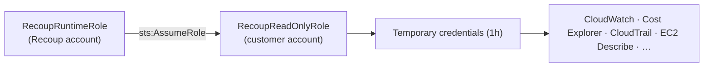

# Cross-Account Onboarding Guide

**Version:** Phase 6e | **Updated:** Sep 11, 2026

This guide walks through connecting any AWS account to Recoup using STS AssumeRole — the same access pattern used by the hackathon demo, extended to a real customer account.

---

## How It Works

Recoup never stores long-lived AWS credentials. Instead, the customer creates a read-only IAM role in their account that trusts Recoup's control-plane role. Recoup calls `sts:AssumeRole` to obtain temporary credentials (1-hour expiry) for each scan.

**Access flow:**


The only change between the hackathon demo (same-account) and production (cross-account) is the account ID in the role ARN. The code path is identical.

---

## Step 1 — Obtain Your External ID

Contact Recoup (or, for the demo, check `RECOUP_EXTERNAL_ID` in your `.env`) to get the External ID for your integration. This is a secret string used in the trust policy condition to prevent the [Confused Deputy problem](https://docs.aws.amazon.com/IAM/latest/UserGuide/confused-deputy.html).

---

## Step 2 — Create RecoupReadOnlyRole in the Customer Account

You can use the CloudFormation template below or create the role manually in the AWS Console.

### CloudFormation Template

Save as `recoup-readonly-role.yaml` and deploy in the customer account:

```yaml
AWSTemplateFormatVersion: "2010-09-09"
Description: >
  RecoupReadOnlyRole — grants Recoup read-only access for cost analysis.
  No write actions on any service.

Parameters:
  RecoupAccountId:
    Type: String
    Description: AWS account ID of the Recoup control plane
    Default: "625962218034"
  ExternalId:
    Type: String
    Description: External ID provided by Recoup (keep secret)
    NoEcho: true

Resources:
  RecoupReadOnlyRole:
    Type: AWS::IAM::Role
    Properties:
      RoleName: RecoupReadOnlyRole
      Description: >
        Recoup read-only analysis role. Assumed via STS AssumeRole with
        ExternalId. No write actions permitted.
      AssumeRolePolicyDocument:
        Version: "2012-10-17"
        Statement:
          - Effect: Allow
            Principal:
              AWS: !Sub "arn:aws:iam::${RecoupAccountId}:role/RecoupRuntimeRole"
            Action: sts:AssumeRole
            Condition:
              StringEquals:
                sts:ExternalId: !Ref ExternalId
      Policies:
        - PolicyName: RecoupReadOnlyPolicy
          PolicyDocument:
            Version: "2012-10-17"
            Statement:
              - Sid: EC2ReadOnly
                Effect: Allow
                Action: ["ec2:Describe*", "ec2:GetConsoleOutput"]
                Resource: "*"
              - Sid: CloudWatchReadOnly
                Effect: Allow
                Action:
                  - cloudwatch:GetMetricStatistics
                  - cloudwatch:GetMetricData
                  - cloudwatch:ListMetrics
                  - cloudwatch:DescribeAlarms
                  - logs:DescribeLogGroups
                  - logs:DescribeLogStreams
                  - logs:FilterLogEvents
                Resource: "*"
              - Sid: CostReadOnly
                Effect: Allow
                Action:
                  - ce:GetCostAndUsage
                  - ce:GetReservationUtilization
                  - ce:GetSavingsPlanUtilization
                  - ce:GetAnomalies
                  - ce:ListCostAllocationTags
                  - cost-optimization-hub:ListRecommendations
                Resource: "*"
              - Sid: CloudTrailReadOnly
                Effect: Allow
                Action:
                  - cloudtrail:LookupEvents
                  - cloudtrail:DescribeTrails
                Resource: "*"
              - Sid: EBSRDSLambdaS3ELBReadOnly
                Effect: Allow
                Action:
                  - elasticloadbalancing:Describe*
                  - rds:Describe*
                  - lambda:List*
                  - "lambda:GetFunction*"
                  - s3:ListAllMyBuckets
                  - s3:GetBucketTagging
                  - s3:GetBucketLifecycleConfiguration
                  - s3:GetBucketLocation
                  - s3:GetBucketMetricsConfiguration
                Resource: "*"
              - Sid: TaggingReadOnly
                Effect: Allow
                Action:
                  - tag:GetResources
                  - tag:GetTagKeys
                  - tag:GetTagValues
                Resource: "*"
              - Sid: ComputeOptimizerReadOnly
                Effect: Allow
                Action:
                  - compute-optimizer:GetEC2InstanceRecommendations
                  - compute-optimizer:GetEBSVolumeRecommendations
                  - compute-optimizer:GetLambdaFunctionRecommendations
                  - compute-optimizer:GetRDSInstanceRecommendations
                Resource: "*"

Outputs:
  RoleArn:
    Value: !GetAtt RecoupReadOnlyRole.Arn
    Description: Paste this ARN into the Recoup Account Scanner Role ARN field
```

**Deploy:**
```bash
aws cloudformation deploy \
  --stack-name recoup-readonly-role \
  --template-file recoup-readonly-role.yaml \
  --capabilities CAPABILITY_NAMED_IAM \
  --parameter-overrides \
    RecoupAccountId=625962218034 \
    ExternalId=<your-external-id>
```

---

## Step 3 — Test the Connection

From Recoup's account (or your local machine with RecoupRuntimeRole credentials):

```bash
# Should succeed
aws sts assume-role \
  --role-arn arn:aws:iam::<CUSTOMER_ACCOUNT>:role/RecoupReadOnlyRole \
  --role-session-name recoup-connection-test \
  --external-id <your-external-id>
# Expected: JSON with Credentials block

# Should fail (wrong ExternalId)
aws sts assume-role \
  --role-arn arn:aws:iam::<CUSTOMER_ACCOUNT>:role/RecoupReadOnlyRole \
  --role-session-name recoup-connection-test \
  --external-id wrong-id
# Expected: An error occurred (AccessDenied)
```

---

## Step 4 — Enter Connection Details in Recoup

1. Open the **Account Scanner** page (`/scan`)
2. Paste the role ARN from the CloudFormation output into **Role ARN**
3. Enter the External ID into **External ID**
4. Select the primary region
5. Click **Scan Account for Savings**

On success, you'll see:
- A green **● STS AssumeRole ✓ · Account XXXXXX** badge in the results header
- Findings from your account sorted by estimated savings

---

## Minimum Permissions Checklist

| Service | Permission set | Required for |
|---|---|---|
| EC2 | `Describe*` | Idle instances, oversized instances |
| CloudWatch | `GetMetric*`, `ListMetrics` | CPU / network utilisation |
| Cost Explorer | `GetCostAndUsage`, `GetAnomalies` | Waste attribution |
| CloudTrail | `LookupEvents` | Change actor attribution |
| RDS | `Describe*` | Idle databases |
| Lambda | `List*`, `GetFunction*` | Underutilised functions |
| S3 | `ListAllMyBuckets`, `GetBucketLifecycle*` | Missing lifecycle policies |
| ELB | `Describe*` | Idle load balancers |
| Tagging API | `GetResources` | Untagged resource cost gap |
| Compute Optimizer | `Get*Recommendations` | Right-sizing suggestions |

---

## Revoking Access

To immediately revoke Recoup's access to a customer account:

```bash
# Option 1 — delete the trust policy entry (role remains, AssumeRole blocked)
aws iam update-assume-role-policy \
  --role-name RecoupReadOnlyRole \
  --policy-document '{"Version":"2012-10-17","Statement":[]}'

# Option 2 — delete the role entirely
aws iam delete-role-policy --role-name RecoupReadOnlyRole --policy-name RecoupReadOnlyPolicy
aws iam delete-role --role-name RecoupReadOnlyRole

# Option 3 — remove the stack (if deployed via CloudFormation)
aws cloudformation delete-stack --stack-name recoup-readonly-role
```

Any in-flight STS sessions (up to 1 hour old) will fail to renew after the trust policy is removed. Recoup will surface an error in the UI and stop scanning.

---

## Same-Account vs Cross-Account

| Property | Hackathon demo (same account) | Production (cross-account) |
|---|---|---|
| Role ARN account ID | `625962218034` (Recoup demo account) | Customer's account ID |
| Role created by | CDK `RecoupIamStack` | Customer (CloudFormation template above) |
| ExternalId | `RECOUP_EXTERNAL_ID` in `.env` | Assigned by Recoup on-boarding |
| Code change needed | None | None — only role ARN changes |

---

## Related Documentation

- [`docs/iam-architecture.md`](iam-architecture.md) — three-role design, trust policies, security invariants
- [`docs/iam-roles.md`](iam-roles.md) — full role inventory with permissions
