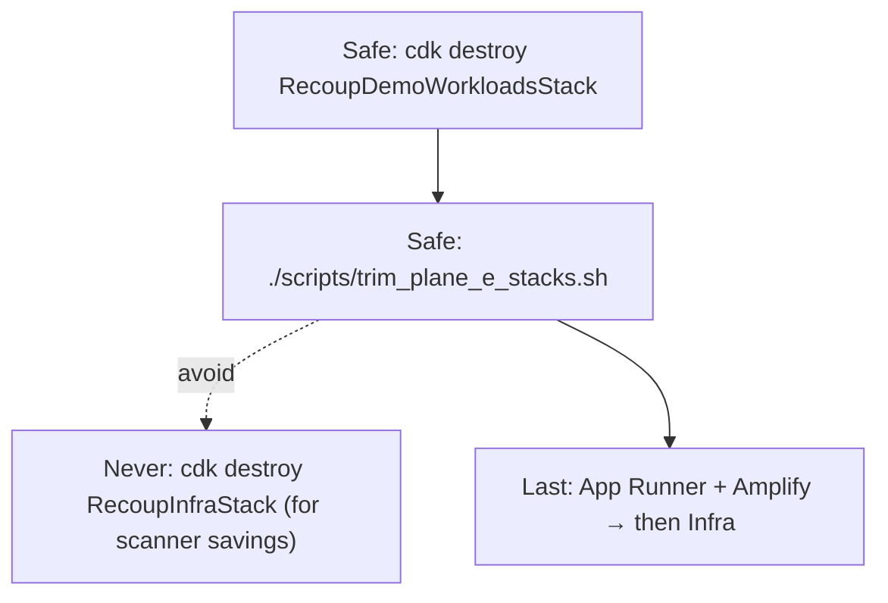

# Demo scanner vs platform segregation

**Account:** 625962218034 · **Region:** us-east-1  
**See also:** [stopped-services.md](./stopped-services.md) · [production-hosting.md](./production-hosting.md)

## Planes

| Plane | CDK / services | Safe to stop/destroy for cost? |
|-------|----------------|--------------------------------|
| **A Hosting** | Amplify, App Runner, ECR, `RecoupAppRunnerRole` | **No** (judges need URL) |
| **B Platform** | `RecoupInfraStack` — DynamoDB, S3, SNS, SQS, KMS | **No** |
| **C Scan bridge** | `RecoupIamStack` — `RecoupReadOnlyRole`, STS | Do not delete roles |
| **D Demo targets** | `RecoupDemoWorkloadsStack` — tagged `RecoupDemo=true` | **Yes** — stop EC2/RDS or destroy stack |
| **E Legacy** | SLA / RecoupDemoStack | **Yes** — `./scripts/trim_plane_e_stacks.sh` |

## Pre-flight (before demo cost ops)

1. Confirm target has `RecoupDemo=true` or stack name `RecoupDemoWorkloadsStack`.
2. Never run `cdk destroy RecoupInfraStack` while App Runner is live.
3. Do not delete SNS topic `recoup-alerts` (billing + recovery reports).

## Post-change checks

```bash
./scripts/post_change_segregation_smoke.sh
# or manually:
curl -sf "https://qawwrm7kzy.us-east-1.awsapprunner.com/health"
curl -sf "https://qawwrm7kzy.us-east-1.awsapprunner.com/health/ready"
aws dynamodb list-tables --query "TableNames[?starts_with(@, 'recoup-')]"
aws sns list-topics --query "Topics[?contains(TopicArn, 'recoup-alerts')]"
```

Empty demo scan after destroying Plane D is **expected**; infra is still healthy.

## Destroy order


