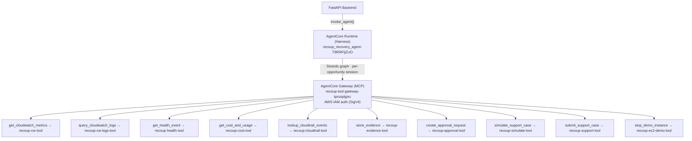

# Recoup — Amazon Bedrock AgentCore Integration

**Files:**  
- Config: `infra/agentcore-config.yaml`  
- Adapter: `backend/src/recoup/adapters/agentcore.py`  
- Registration script: `scripts/register_agentcore.py`  
**Last updated:** Sep 11, 2026  
- IDs output: `infra/agentcore-ids.json`  
**Status:** Phase 0 complete — Harness + Gateway live in `us-east-1`

> **API Note:** Classic Bedrock Agents (`create_agent`) is in maintenance mode for new AWS accounts since July 30, 2026. Recoup uses the new `bedrock-agentcore-control` API exclusively (`create_harness`, `create_gateway`).

---

## Provisioned Resources

| Resource | ID / URL | Purpose |
|---------|---------|---------|
| AgentCore Harness | `recoup_recovery_agent-T9RRFljZUO` | Hosts the Strands agent graph with per-opportunity session isolation |
| AgentCore Gateway | `recoup-tool-gateway-tpnzqdgixc` | MCP tool endpoint — **12 tools** in `infra/agentcore-config.yaml` ( **`get_support_case_status`** is in `TOOL_REGISTRY` but not yet in Gateway YAML) |
| Gateway URL | `https://recoup-tool-gateway-tpnzqdgixc.gateway.bedrock-agentcore.us-east-1.amazonaws.com/mcp` | MCP endpoint for tool invocation |

---

## Architecture



---

## AgentCore Runtime (Harness)

### Configuration

```yaml
runtime:
  name: recoup-recovery-agent
  model_id: ${BEDROCK_MODEL_ID}               # never hard-coded
  session_idle_timeout_seconds: 3600          # 1-hour idle timeout
  max_session_duration_seconds: 14400         # 4-hour hard cap
  log_group: /recoup/runtime
  execution_role_arn: ${RECOUP_RUNTIME_ROLE_ARN}
  enable_trace: true
  trace_level: STANDARD
```

### Session Isolation

```yaml
session:
  isolation: STRICT   # each opportunity_id gets its own isolated session
  principal_source: COGNITO   # or IAM for dev/test
  audit_all_tool_calls: true
```

`STRICT` isolation means no cross-contamination of state between different recovery opportunities. A breach in session A cannot affect session B.

### System Prompt

```
You are a Recoup recovery agent. You investigate AWS SLA breaches,
collect evidence, and prepare support cases for human approval.
You NEVER make financial conclusions — all credit calculations are
performed by deterministic engines. You NEVER take destructive actions
without explicit human approval.
```

---

## AgentCore Gateway

### Protocol

The gateway uses the **Model Context Protocol (MCP)** — the same standard used by Claude.ai, Cursor, and other MCP-compatible hosts.

**Authentication:** `AWS_IAM` (SigV4-signed requests). All calls from the runtime to the gateway are authenticated.

### Tool Inventory

| Tool | Action Class | Lambda |
|------|-------------|--------|
| `get_cloudwatch_metrics` | `READ` | `recoup-cw-tool` |
| `query_cloudwatch_logs` | `READ_SENSITIVE` | `recoup-cw-logs-tool` |
| `get_health_event` | `READ` | `recoup-health-tool` |
| `get_cost_and_usage` | `READ_FINANCIAL` | `recoup-cost-tool` |
| `get_cost_anomalies` | `READ_FINANCIAL` | `recoup-cost-tool` |
| `list_cost_optimization_recommendations` | `READ_FINANCIAL` | `recoup-cost-tool` |
| `lookup_cloudtrail_events` | `READ_SENSITIVE` | `recoup-cloudtrail-tool` |
| `store_evidence` | `WRITE_INTERNAL` | `recoup-evidence-tool` |
| `create_approval_request` | `WRITE_INTERNAL` | `recoup-approval-tool` |
| `simulate_support_case` | `WRITE_INTERNAL` | `recoup-simulate-tool` |
| `submit_support_case` | `WRITE_EXTERNAL_FINANCIAL` | `recoup-support-tool` |
| `stop_demo_instance` | `MUTATE_RED` | `recoup-ec2-demo-tool` |

### Cedar Policy Guards

Tools with `requires_approval: true` are gated by Cedar policies:

| Tool | Policy Guard |
|------|-------------|
| `submit_support_case` | `RecoupSubmitCasePolicy` |
| `stop_demo_instance` | `RecoupStopInstancePolicy` |

Cedar default behavior: **deny**. Both guards require:
1. A valid, unexpired `ApprovalRecord`
2. `recoup_enable_real_support_submission == true` (for submit_support_case)
3. The specific Cedar rule to evaluate to `ALLOW`

---

## Registration Script

**File:** `scripts/register_agentcore.py`  
**API used:** `bedrock-agentcore-control` (new, replaces `bedrock-agent`)

### Usage

```bash
# Full registration (requires CDK to be deployed first)
python scripts/register_agentcore.py

# Dry run (no AWS calls — prints what would happen)
python scripts/register_agentcore.py --dry-run

# Skip Lambda target registration (for Phase 0, before Lambdas exist)
python scripts/register_agentcore.py --skip-targets

# Specify region
python scripts/register_agentcore.py --region us-east-1
```

### What the Script Does

**Step 1 — Create AgentCore Harness:**
```python
control.create_harness(
    harnessName="recoup_recovery_agent",
    executionRoleArn=runtime_role_arn,
    model={"bedrockModelConfig": {"modelId": model_id}},
    systemPrompt=[{"text": SYSTEM_PROMPT}],
    environment={
        "agentCoreRuntimeEnvironment": {
            "lifecycleConfiguration": {"idleRuntimeSessionTimeout": 3600},
            "networkConfiguration": {"networkMode": "PUBLIC"},
        }
    },
)
```

**Step 2 — Create AgentCore Gateway:**
```python
control.create_gateway(
    name="recoup-tool-gateway",
    roleArn=gateway_role_arn,
    protocolType="MCP",
    authorizerType="AWS_IAM",
)
```

**Step 3 — Register Lambda targets** (once Lambda ARNs are available):
```python
control.create_gateway_target(
    gatewayIdentifier=gateway_id,
    name="recoup-cloudwatch-tools",
    targetConfiguration={
        "lambda": {
            "lambdaArn": lambda_arn,
            "toolSchema": {...}
        }
    },
    credentialProviderConfigurations=[{"credentialProviderType": "GATEWAY_IAM_ROLE"}],
)
```

### Output

After successful registration, `infra/agentcore-ids.json` is written:

```json
{
  "harness_id": "recoup_recovery_agent-T9RRFljZUO",
  "harness_arn": "arn:aws:bedrock-agentcore:us-east-1:...",
  "gateway_id": "recoup-tool-gateway-tpnzqdgixc",
  "gateway_target_ids": ["..."],
  "region": "us-east-1"
}
```

Add these to `.env`:
```bash
RECOUP_AGENTCORE_HARNESS_ID=recoup_recovery_agent-T9RRFljZUO
RECOUP_AGENTCORE_HARNESS_ARN=arn:aws:bedrock-agentcore:us-east-1:...
RECOUP_AGENTCORE_GATEWAY_ID=recoup-tool-gateway-tpnzqdgixc
```

---

## `AgentCoreAdapter` (Python)

**File:** `backend/src/recoup/adapters/agentcore.py`

```python
class AgentCoreAdapter:
    def invoke(
        self,
        prompt: str,
        session_id: str,
        memory_id: str | None = None,
        extra_context: dict[str, Any] | None = None,
    ) -> dict[str, Any]:
        """Invoke the Recoup agent on AgentCore Runtime."""

    def register_tool(
        self,
        tool_name: str,
        lambda_arn: str,
        input_schema: dict[str, Any],
        description: str,
        action_class: str = "READ",
    ) -> dict[str, Any]:
        """Register a single tool with the AgentCore Gateway."""

    def register_all_tools(self) -> list[dict[str, Any]]:
        """Register all tools from TOOL_REGISTRY."""
```

### Phase 1 Stub Behavior

If `RECOUP_AGENTCORE_RUNTIME_ARN` is not configured, `invoke()` returns:
```json
{
  "sessionId": "...",
  "output": {"text": "[AgentCore stub — not configured]"},
  "_stub": true
}
```

This allows local development and CI to run without Bedrock credentials.

---

## Bedrock Model Selection

The model ID is always read from `BEDROCK_MODEL_ID` and never hard-coded.

**Default (no env var):** `us.amazon.nova-pro-v1:0`  
- Amazon Nova Pro: instant access for new accounts, no approval gate
- Supports tool use, streaming, and long context

**For production:** `claude-3-5-sonnet-20241022`  
- Higher quality reasoning for incident correlation
- Requires Bedrock model access enabled in the account

---

## Environment Variables

| Variable | Description | Source |
|---------|-------------|--------|
| `RECOUP_AGENTCORE_HARNESS_ID` | Harness instance ID | `infra/agentcore-ids.json` |
| `RECOUP_AGENTCORE_HARNESS_ARN` | Harness ARN | `infra/agentcore-ids.json` |
| `RECOUP_AGENTCORE_GATEWAY_ID` | Gateway ID | `infra/agentcore-ids.json` |
| `RECOUP_AGENTCORE_GATEWAY_URL` | Gateway MCP URL | Gateway creation response |
| `RECOUP_RUNTIME_ROLE_ARN` | IAM role for Harness | CDK outputs |
| `RECOUP_GATEWAY_EXECUTION_ROLE_ARN` | IAM role for Gateway | CDK outputs |
| `BEDROCK_MODEL_ID` | Bedrock model to use | Manual / default |
| `BEDROCK_REGION` | AWS region | Default: `us-east-1` |

All variables are documented in `.env.example` at the repo root.

---

## Re-registration

If you need to re-register (e.g. after a tear-down):

```bash
# The script handles ConflictException gracefully:
# if harness/gateway already exists, it fetches and returns the existing ID
python scripts/register_agentcore.py

# Or force-skip targets and just get the IDs:
python scripts/register_agentcore.py --skip-targets
```

---

## Verification

```bash
# Confirm the harness exists
aws bedrock-agentcore-control list-harnesses --region us-east-1 \
  --query "harnesses[?harnessName=='recoup_recovery_agent']"

# Confirm the gateway exists
aws bedrock-agentcore-control list-gateways --region us-east-1 \
  --query "gateways[?name=='recoup-tool-gateway']"

# View the IDs file
cat infra/agentcore-ids.json
```
