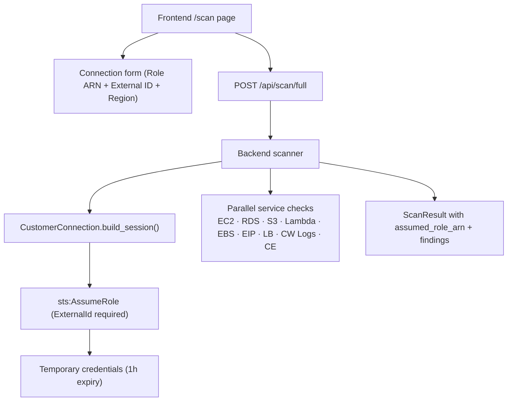

# Recoup — Architecture Overview

> **Superseded.** Use [recoup-overall-architecture.md](../../recoup-overall-architecture.md) and [architecture/architecture.svg](../../../architecture/architecture.svg). Metrics: [docs/README.md](../../README.md) (**419** pytest · **127** Playwright).

**Last Updated:** Sep 11, 2026 (archived)

---

## System Purpose

Recoup is an autonomous cloud-spend recovery agent. It monitors AWS workloads for recoverable spend, packages findings into HITL-gated recovery opportunities, and records outcomes in a Recovery Ledger — involving humans at genuine policy boundaries (financial and destructive actions).

**Primary operator path (J-FULL):** nine AWS account scanners → promote finding → claim-bound approve / investigate / decline → ledger (+ SNS on approve). Documented in [operator-journey.md](operator-journey.md). The **11-node Strands graph** is **not** streamed on promote; it is optional via `POST /api/opportunities/{id}/run` and exercised by **pytest** golden replay (`adapters/replay.py`). Public `/api/replay/*` and the `/replay` UI were removed Sep 2026.

---

## High-Level Architecture

```mermaid
flowchart TB
    fe["Frontend (Next.js 16)<br/>Sidebar: Opportunities · Account Scanner · Recovery Ledger<br/>+ /opportunities/[id] HITL; optional SSE on agent re-run"]
    api["FastAPI Backend (Python 3.12)<br/>/api/scan · /api/opportunities · /api/approvals · /api/quality"]
    runtime["Amazon Bedrock AgentCore Runtime<br/>recoup_recovery_agent-T9RRFljZUO"]
    graph["Strands Agent Graph (11 nodes)<br/>normalize_event → incident_correlation → sla_contract_resolver → availability_calculator → evidence_collector → evidence_sanitizer → eligibility_reasoner → risk_policy_gate → await_human_approval (HITL) → claim_package_generator → submission_adapter → case_monitor"]
    gateway["AgentCore Gateway<br/>recoup-tool-gateway-tpnzqdgixc<br/>13 narrow typed tools · Cedar policy"]
    data["AWS Data Sources<br/>CloudWatch · Cost Explorer · CloudTrail · Health · Support"]
    storage["Persistent Storage<br/>DynamoDB · S3 · SQS · EventBridge"]

    fe -->|"HTTP / SSE"| api
    api --> runtime
    runtime --> graph
    runtime -->|"MCP"| gateway
    gateway -->|"IAM role-scoped invocations"| data
    data --> storage
```

---

## Core Design Principles

| Principle | Implementation |
|-----------|---------------|
| **LLMs propose; contracts decide** | All financial arithmetic, SLA credit calculation, and state transitions are deterministic Python — no LLM involvement |
| **Default-deny writes** | READ tools are automatic; `submit_support_case` requires an unexpired `ApprovalRecord` + Cedar policy ALLOW |
| **Evidence never raw** | Raw evidence is encrypted in S3 (KMS CMK). Only SHA-256 hashes and sanitized previews reach the agent or UI |
| **Scanner-first UI** | Primary demo is J-FULL account scan → HITL → ledger; graph/SSE depth is optional (`POST .../run`) or pytest replay |
| **Auditable** | Every tool call produces a `ToolAudit` record. Every node execution produces a structured log event |
| **Idempotent** | Every external action carries an idempotency key. Duplicate events create exactly one opportunity |
| **Live-first** | Production paths use real AWS (DynamoDB, S3, CloudWatch) with in-memory fallbacks in dev. Demo routes may label `simulation` fixtures; Support submit and destructive actions remain gated by Cedar + HITL |

---

## Demo proofs (J-FULL vs optional depth)

### Proof 1 — Account scanner loop (primary — J-FULL)

```
Demo scan (9 read-only scanners, STS RecoupReadOnlyRole)
  → findings on /opportunities (8 scenario tags · ~$87.82/mo aggregate)
  → Start Recovery (promote) → AWAITING_APPROVAL + claim-bound HITL
  → Approve / Investigate / Decline on /opportunities/{id}
  → Recovery Ledger buckets; SNS recovery report on approve
```

Documented end-to-end in [operator-journey.md](operator-journey.md). Playwright: `journey-full-discovery-triage-ledger.spec.ts`.

### Proof 2 — SLA verified replay (optional — pytest / scorecard)

Deterministic API Gateway SLA math (~**$0.35** credit) via `ReplayAdapter` and golden **pytest** (`tests/e2e/test_golden_replay.py`). Feeds `GET /api/quality/scorecard` replay P95 gates. **No** public `/api/replay/*` HTTP (removed Sep 2026). Optional UI depth: `POST /api/opportunities/{id}/run` + SSE stream on opportunity detail.

### Removed from product (Sep 2026)

Live EC2 **StopInstances** demo HTTP (`/api/ec2-demo/*`) and governance demo routes were removed; J-FULL promote uses **`apply_cost_recovery`** only.

### Live AWS Services Coverage (Phase 6b)

| Service | Purpose | Status |
|---------|---------|--------|
| S3 `recoup-evidence` (KMS) | Evidence writes during SLA replay | ✅ Live |
| DynamoDB `recoup-approvals` | HITL approval records | ✅ Live |
| CloudWatch Logs `/recoup/runtime` | HITL audit trail | ✅ Live |
| S3 `recoup-eval-fixtures` | Scorecard persistence | ✅ Live |
| CloudWatch `GetMetricStatistics` | EC2 CPU idle check | ✅ Live |
| CloudTrail `LookupEvents` | EC2 ownership + no-actor attribution | ✅ Live |
| EC2 `StopInstances` | Tool registry / AgentCore (not J-FULL promote) | ✅ Gated |
| KMS `alias/recoup-evidence` | Evidence encryption | ✅ Live |
| SNS `recoup-alerts` | Opportunity + stop notifications | ✅ Live |
| SQS `recoup-recovery-events` | Opportunity event bus | ✅ Live |
| ResourceGroupsTaggingAPI | Missing cost tag scan | ✅ Live |
| Cost Explorer `GetCostAndUsage` | Real account spend + per-service breakdown | ✅ Live |
| EventBridge + SQS poller | Health events ack-only (no auto replay in J-FULL) | ✅ Live |
| CloudWatch custom metrics + dashboard | `Recoup` namespace · `Recoup-Demo` dashboard | ✅ Live |
| Bedrock AgentCore Runtime | Strands graph host | ✅ Live |

---

## Repository Layout

```
recoup/
├── backend/src/recoup/
│   ├── models/          9 Pydantic v2 domain models
│   ├── engines/         calculator.py + sla_resolver.py (deterministic math)
│   ├── graph/           types.py · nodes.py · recoup_graph.py · state_machine.py
│   ├── tools/           aws_tools.py · internal_tools.py · ec2_tools.py · registry.py
│   ├── adapters/        replay.py · agentcore.py · finding_to_signal.py
│   ├── agents/          strands_agents.py (4 Strands agents backed by Amazon Bedrock)
│   ├── api/             FastAPI: main.py + routes/
│   │                      scan · opportunities · approvals · quality
│   ├── hooks/           tracing.py (RecoupTracingHooks)
│   ├── evidence/        collector.py · sanitizer.py (KMS S3, 8 redaction patterns)
│   ├── safety/          autonomy.py · cedar.py · exceptions.py
│   ├── approval/        store.py · flow.py (DynamoDB-backed HITL)
│   └── scanners/        9 scanners: ec2 · ebs · eip · rds · s3 · lambda · lb · cwlogs · cost_explorer
├── backend/tests/       407 tests collected (unit + trajectory + e2e + adversarial)
├── frontend/src/app/    Next.js 16 · routes: / → /opportunities · /scan · /recovery
│                          /opportunities/[id] · /approvals & /quality redirect to /opportunities
├── infra/cdk/           RecoupInfraStack + RecoupDemoStack + RecoupIamStack + RecoupDemoWorkloadsStack (TypeScript)
├── infra/agentcore-config.yaml  13 tools with action classes + policy guards
├── infra/policy/        recoup-policy.cedar (Cedar policies)
├── docs/                architecture docs (see architecture-overview.md; no checked-in architecture.svg)
├── scripts/             deploy.sh · verify_infra.sh · register_agentcore.py
│                        reset_demo_instance.sh · generate_canonical_fixtures.py
│                        replay_run.py · run_eval_suite.py · assert_ship_gates.py
│                        inject_sla_metrics.py · fire_demo_event.py · create_cw_dashboard.py
├── docs/                This document and others (see index below)
├── sla_catalog/         Human-verified SLA contracts (source_hash enforced)
├── eval_fixtures/       Immutable replay seed artifacts (committed + S3-synced)
│   └── sla/api_gateway/canonical/
│       health_event.json · metric_series.json · billing_snapshot.json
│       cloudtrail_events.json · sla_contract_ref.yaml · expected_output.json
└── plans/               Phase-by-phase implementation plans
```

---

## Technology Stack

| Layer | Technology | Version |
|-------|-----------|---------|
| Agent Framework | Amazon Bedrock AgentCore (Strands) | Latest (bedrock-agentcore-control API) |
| LLM | Amazon Bedrock (Nova Pro default; Claude 3.5 Sonnet for prod) | `us.amazon.nova-pro-v1:0` / `claude-3-5-sonnet-20241022` |
| Strands SDK | `strands-agents` + `strands-agents-tools` | ≥ 0.1.0 |
| Backend | FastAPI + Uvicorn | Python 3.12 |
| Domain Models | Pydantic v2 | 2.x |
| Infrastructure | AWS CDK | 2.267+ (TypeScript) |
| Frontend | Next.js 16 + TypeScript + Tailwind 4 | Node 20 |
| Database | Amazon DynamoDB | On-demand, PAY_PER_REQUEST |
| Evidence Storage | Amazon S3 + KMS CMK | — |
| Event Bus | Amazon EventBridge + SQS | — |
| Policy | AgentCore Policy (Cedar) | — |
| CI | GitHub Actions | ubuntu-latest |
| Linting | ruff + mypy | — |

---

## AWS Resources Provisioned

### RecoupInfraStack (CDK)

| Resource | Name | Purpose |
|---------|------|---------|
| KMS Key | `alias/recoup-evidence` | Encrypts evidence S3 + DynamoDB |
| S3 Bucket | `recoup-evidence-{acct}-{region}` | Raw evidence storage (KMS, versioned) |
| S3 Bucket | `recoup-sla-catalog-{acct}-{region}` | SLA contract YAML files (SSE, versioned) |
| S3 Bucket | `recoup-eval-fixtures-{acct}-{region}` | Replay seed artifacts (SSE, versioned) |
| DynamoDB | `recoup-opportunities` | Main opportunity records + GSIs |
| DynamoDB | `recoup-approvals` | HITL approval records (TTL) |
| DynamoDB | `recoup-tool-audits` | Tool call audit log |
| DynamoDB | `recoup-outcome-metadata` | Service/region/month outcome summaries |
| SQS Queue | `recoup-recovery-events` | Incoming health/anomaly events |
| SQS DLQ | `recoup-recovery-events-dlq` | Failed event dead-letter queue |
| EventBridge Rule | `RecoupHealthEventRule` | Routes AWS Health events → SQS |
| CloudWatch Log Group | `/recoup/runtime` | AgentCore Runtime logs |
| CloudWatch Log Group | `/recoup/gateway` | AgentCore Gateway logs |
| CloudWatch Log Group | `/recoup/api` | FastAPI backend logs |
| CloudWatch Alarm | `RecoupEstimatedChargesAlarm` | Fires at $10 estimated charges |
| SNS Topic | `recoup-alerts` | Cost alarm notification target |
| IAM Role | `RecoupRuntimeRole` | Bedrock AgentCore Runtime execution |
| IAM Role | `RecoupGatewayExecutionRole` | Gateway Lambda invocation |
| IAM Role | `RecoupReadConnectorRole` | Read-only tool Lambdas |

### RecoupDemoStack (CDK)

| Resource | Name | Purpose |
|---------|------|---------|
| EC2 Instance | `t3.micro` (tag: `RecoupDemo=true`) | Live AWS action demo target |

### RecoupIamStack (CDK — Phase 6e)

| Resource | Name | Purpose |
|---------|------|---------|
| IAM Role | `RecoupReadOnlyRole` | Scoped read-only role for Account Scanner (STS AssumeRole via ExternalId) |
| IAM Role | `RecoupRemediationRole` | `ec2:StopInstances` only on `RecoupDemo=true` resources; TerminateInstances hard-denied |

### RecoupDemoWorkloadsStack (CDK — Phase 6f)

| Resource | Scenario Tag | Purpose |
|---------|------|---------|
| EC2 `t3.medium` | `oversized-ec2` | CPU < 5% 7d — idle instance ($30.37/mo) |
| EBS `gp3` 100 GiB | `unattached-ebs` | Detached from all instances ($10.00/mo) |
| EBS `gp2` 50 GiB | `gp2-migration` | Upgrade to gp3 candidate ($5.00/mo) |
| Elastic IP | `idle-eip` | Unassociated EIP ($3.65/mo) |
| RDS `db.t3.micro` MySQL | `idle-rds` | CPU < 5%, 0 connections ($12.41/mo) |
| S3 bucket | `s3-no-lifecycle` | No lifecycle policy ($5.00/mo) |
| Lambda 1024 MB | `oversized-lambda` | < 5 invocations / 30d ($3.75/mo) |
| EBS snapshot | `stale-snapshot` | Source volume deleted ($0.05/mo) |

### AgentCore (registered via script)

| Resource | ID | Purpose |
|---------|-----|---------|
| AgentCore Harness | `recoup_recovery_agent-T9RRFljZUO` | Strands graph host |
| AgentCore Gateway | `recoup-tool-gateway-tpnzqdgixc` | MCP tool endpoint |
| Gateway URL | `https://recoup-tool-gateway-tpnzqdgixc.gateway.bedrock-agentcore.us-east-1.amazonaws.com/mcp` | MCP endpoint |

---

## Data Flow — Full Pipeline

```
1. INGEST
   EventBridge Health event / SQS message / Replay seed
   → normalize_event node
   → IncidentSignal (typed, idempotency key generated)

2. CORRELATE (Agent)
   → incident_correlation node
   → CloudWatch metrics + Health events + CloudTrail
   → IncidentHypothesis (service, region, intervals, confidence)

3. RESOLVE
   → sla_contract_resolver node
   → sla_catalog/{service}/{date}.yaml
   → SLAContract (commitment %, credit tiers)

4. CALCULATE
   → availability_calculator node (pure Decimal math)
   → AvailabilityResult (uptime %, tier %, credit $)

5. COLLECT EVIDENCE (Agent)
   → evidence_collector node
   → CloudWatch + logs + billing → S3 (raw, KMS encrypted)
   → EvidenceManifest (evidence IDs only, no raw content)

6. SANITIZE
   → evidence_sanitizer node (deterministic redaction)
   → RedactionReport + sanitized EvidenceManifest

7. ASSESS ELIGIBILITY (Agent)
   → eligibility_reasoner node (reads evidence by ID only)
   → EligibilityAssessment (eligible?, confidence, satisfied requirements)

8. POLICY GATE
   → risk_policy_gate node (Cedar policy evaluation)
   → PolicyDecision: ALLOW / REQUIRE_APPROVAL / DENY

9. HUMAN-IN-THE-LOOP (if REQUIRE_APPROVAL)
   → await_human_approval (HITL pause)
   → Human reviews and approves on opportunity detail
   → ApprovalRecord stored in DynamoDB

10. PACKAGE CLAIM (Agent, post-approval)
    → claim_package_generator node
    → ClaimPackage (subject, body, evidence IDs, calculator hash)

11. SUBMIT
    → submission_adapter node
    → Without valid approval: deterministic replay case ID (safe, no real submission)
    → With valid approval + recoup_enable_real_support_submission=True: real AWS Support case

12. MONITOR (Agent)
    → case_monitor node
    → CaseOutcome (PENDING / RESOLVED_APPROVED / RESOLVED_REJECTED)
```

---

---

## Account Scanner & IAM Security Model *(Phase 6d + 6e)*

The Account Scanner (`/api/scan`) lets users scan **their own** AWS account for cost-saving opportunities. It does not use the SLA recovery graph.

**Phase 6e:** Raw access keys replaced with **STS AssumeRole**. The caller provides a Role ARN + External ID; Recoup assumes the role and obtains 1-hour temporary credentials.



**IAM Security Roles (Phase 6e):**

| Role | Purpose | Trust |
|---|---|---|
| `RecoupRuntimeRole` | Application execution identity | `bedrock.amazonaws.com` |
| `RecoupReadOnlyRole` | Read-only analysis (all inventory/cost/telemetry reads) | `RecoupRuntimeRole` + ExternalId |
| `RecoupRemediationRole` | `ec2:StopInstances` on `RecoupDemo=true` only | `RecoupRuntimeRole` + ExternalId |

**Security properties:**
- Analysis role `RecoupReadOnlyRole` **cannot** call `ec2:StopInstances`
- Remediation role `RecoupRemediationRole` **cannot** read billing or metrics
- `ec2:TerminateInstances` **explicitly denied** in `RecoupRemediationRole`
- Temporary credentials expire within 1 hour — never stored or returned

See [`docs/iam-architecture.md`](iam-architecture.md) for the full three-role design.

---

## Documentation Index

| Document | What it covers |
|---------|---------------|
| [agent-graph.md](agent-graph.md) | All 11 nodes, types, tools, inputs/outputs, edge conditions |
| [domain-models.md](domain-models.md) | All 9 Pydantic domain models with fields and validators |
| [api-reference.md](api-reference.md) | FastAPI endpoints: request/response shapes, error codes |
| [tool-registry.md](tool-registry.md) | 13 tools: action classes, Lambda targets, allowed nodes |
| [sla-calculator.md](sla-calculator.md) | SLA formula, credit tiers, golden test spec, Decimal precision |
| [replay-system.md](replay-system.md) | Verified Replay: canonical SLA scenario — real billing data, how it works |
| [state-machine.md](state-machine.md) | Opportunity states, valid transitions, DynamoDB optimistic locking |
| [tracing-hooks.md](tracing-hooks.md) | Hook types, tool allowlists, redaction patterns, ToolAudit |
| [agentcore-integration.md](agentcore-integration.md) | AgentCore Runtime + Gateway: registration, config, IDs |
| [infrastructure-runbook.md](infrastructure-runbook.md) | Deploy, tear down, cost estimate, troubleshooting |
| [iam-roles.md](iam-roles.md) | All IAM roles, permissions, verification commands |
| [iam-architecture.md](iam-architecture.md) | 3-role STS AssumeRole design, trust policies, ExternalId *(Phase 6e)* |
| [cross-account-onboarding.md](cross-account-onboarding.md) | Customer role setup, CloudFormation template, revocation *(Phase 6e)* |
| [ci-guide.md](ci-guide.md) | CI jobs, adding tests, badges, troubleshooting |
